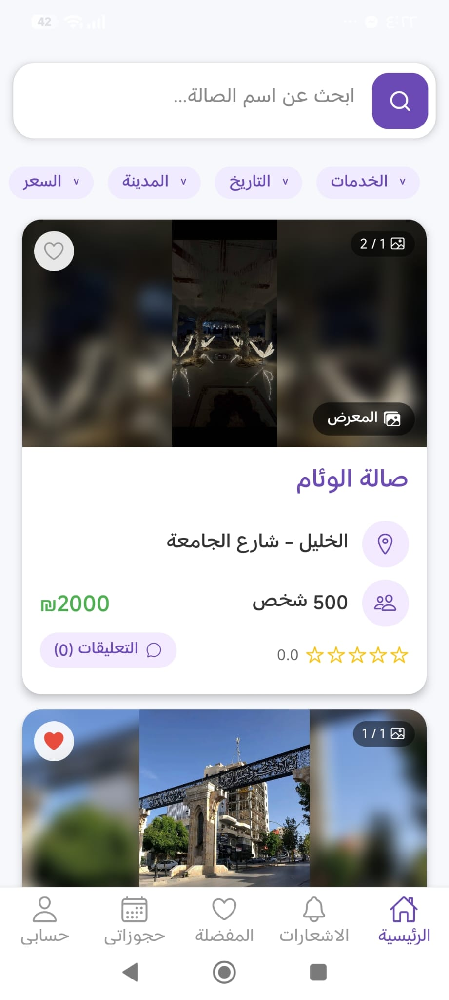
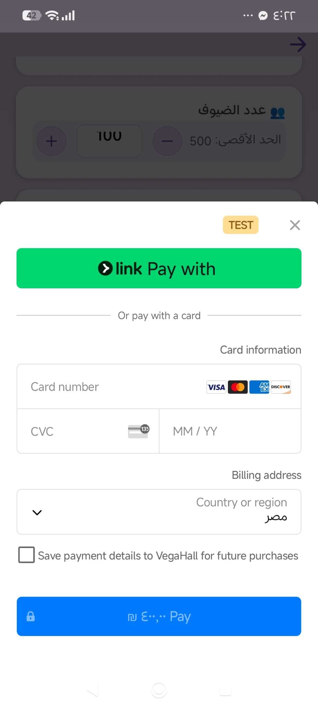
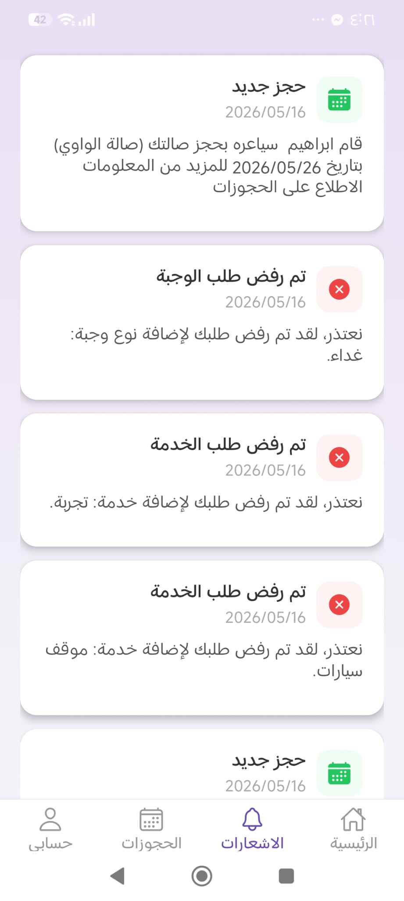
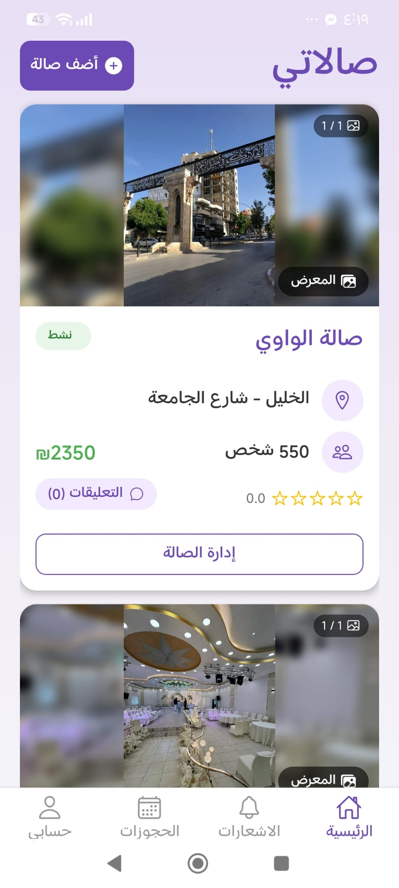
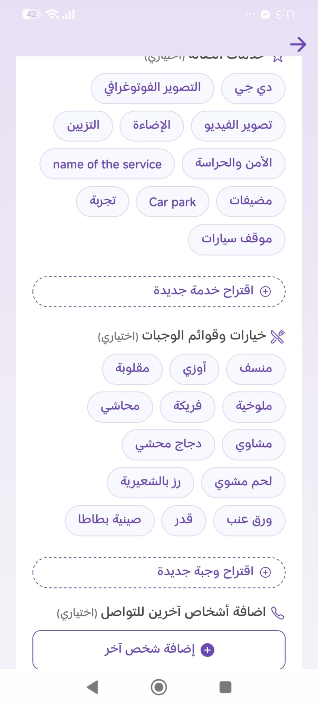
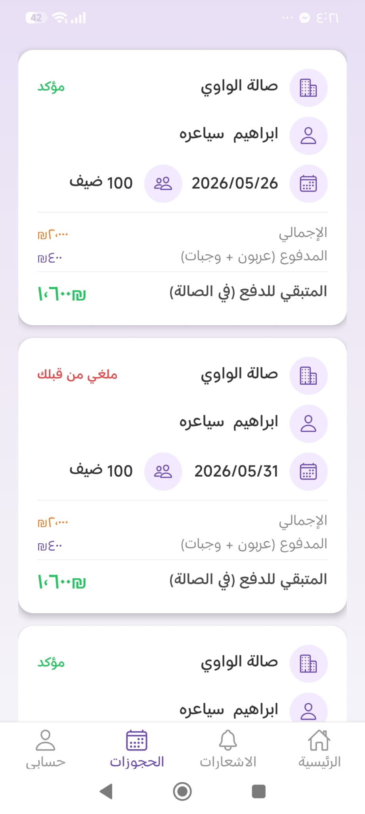
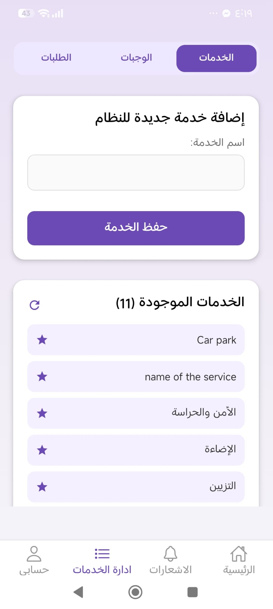
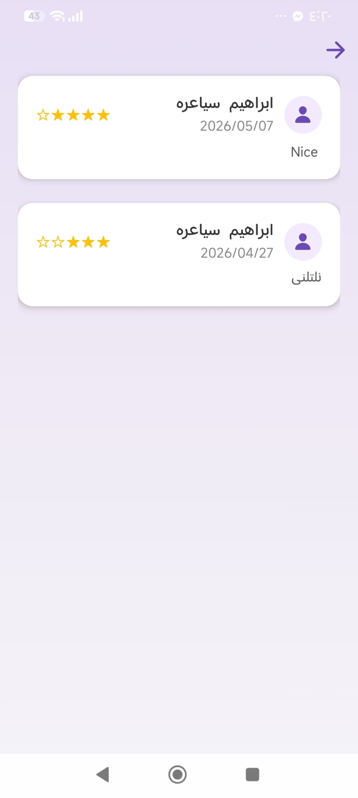

# VegaHall 🎪

[](https://www.youtube.com/watch?v=uNUfg0uG8ug)

**▶️ Click above to watch the demo video on YouTube**

A comprehensive platform for booking and managing event halls with integrated payment processing, real-time notifications, and multi-user support.

## 📋 Table of Contents

- [Overview](#overview)
- [Features](#features)
- [Screenshots](#-screenshots)
- [Tech Stack](#tech-stack)
- [Project Structure](#project-structure)
- [Prerequisites](#prerequisites)
- [Installation](#installation)
- [Configuration](#configuration)
- [Running the Project](#running-the-project)
- [API Documentation](#api-documentation)
- [Database](#database)
- [Contributing](#contributing)
- [License](#license)

## 🎯 Overview

VegaHall is a full-stack event hall booking platform that connects customers with hall owners. The platform includes a mobile app for customers to browse and book halls, a system for hall owners to manage their properties, and an admin panel for platform management. It features integrated Stripe payments, real-time notifications, and database-driven location services.

## ✨ Features

### Customer Features

- Browse available event halls
- Filter and search by location, date, and capacity
- Make bookings and manage reservations
- Real-time payment processing via Stripe
- Push notifications for booking updates
- Calendar view for available dates

### Hall Owner Features

- Create and manage hall listings
- Update availability and pricing
- View and manage bookings
- Track earnings and payments
- Respond to customer inquiries

### Admin Features

- Manage users and hall owners
- Monitor transactions and payments
- Verify hall listings
- Platform analytics and reporting

## � Screenshots

<details>
<summary><b>👥 Customer Screenshots (6)</b></summary>








</details>

<details>
<summary><b>🏢 Hall Owner Screenshots (6)</b></summary>








</details>

<details>
<summary><b>⚙️ Admin Screenshots (3)</b></summary>





</details>

## �🛠 Tech Stack

### Backend

- **Runtime**: Node.js
- **Language**: TypeScript
- **Framework**: Express.js
- **Database**: PostgreSQL (via Supabase)
- **Authentication**: JWT
- **Payment Processing**: Stripe API
- **Email Service**: Nodemailer
- **Push Notifications**: Expo Push Notifications
- **ORM/Query**: node-postgres (pg)
- **Job Scheduling**: node-cron

### Frontend

- **Framework**: React Native with Expo
- **Language**: TypeScript
- **Navigation**: React Navigation
- **State Management**: Async Storage
- **Payment**: Stripe React Native SDK
- **Maps**: React Native Maps
- **Database Client**: Supabase JS Client
- **UI Enhancements**:
  - Expo Vector Icons
  - React Native Calendars
  - Modal Date/Time Picker
  - Toast Notifications

### Infrastructure

- **Backend Hosting**: Vercel
- **Database Hosting**: Supabase (PostgreSQL)
- **Version Control**: Git/GitHub

## 📁 Project Structure

```
VegaHall/
├── backend/
│   ├── src/
│   │   ├── controllers/
│   │   │   ├── adminControllers/
│   │   │   ├── customerControllers/
│   │   │   ├── hallOwnerControllers/
│   │   │   └── userControllers/
│   │   ├── routes/
│   │   │   ├── auth.ts
│   │   │   ├── adminRoutes.ts
│   │   │   ├── customerRoutes.ts
│   │   │   ├── hallRoutes.ts
│   │   │   ├── notificationRoutes.ts
│   │   │   └── userRoutes.ts
│   │   ├── services/
│   │   │   ├── authService.ts
│   │   │   └── supabaseClient.ts
│   │   ├── middleware/
│   │   │   └── sessionMiddleware.ts
│   │   ├── utils/
│   │   │   ├── email.ts
│   │   │   ├── refundPayment.ts
│   │   │   └── handleVerificationError.ts
│   │   ├── db.ts
│   │   └── server.ts
│   ├── supabase/
│   │   ├── config.toml
│   │   └── migrations/ (Database schema)
│   ├── package.json
│   ├── tsconfig.json
│   └── vercel.json
└── frontend/
    ├── components/
    ├── assets/
    ├── android/
    ├── App.tsx
    ├── package.json
    ├── app.json
    ├── eas.json (EAS Build configuration)
    └── tsconfig.json
```

## 📦 Prerequisites

- **Node.js**: v18 or higher
- **npm** or **yarn**: Package manager
- **Git**: For version control
- **Expo CLI** (for frontend development)
- **Supabase Account**: For database
- **Stripe Account**: For payment processing
- **Nodemailer Setup**: For email notifications

## 🚀 Installation

### 1. Clone the Repository

```bash
git clone https://github.com/muhammad13801/VegaHall.git
cd VegaHall
```

### 2. Backend Setup

```bash
cd backend
npm install
```

### 3. Frontend Setup

```bash
cd ../frontend
npm install
```

## ⚙️ Configuration

### Backend Environment Variables

Create a `.env` file in the `backend` directory:

```env
# Supabase Configuration
SUPABASE_URL=your_supabase_url
SUPABASE_KEY=your_supabase_api_key
SUPABASE_DB_PASSWORD=your_database_password

# JWT Configuration
JWT_SECRET=your_jwt_secret_key
JWT_REFRESH_SECRET=your_jwt_refresh_secret_key

# Stripe Configuration
STRIPE_SECRET_KEY=your_stripe_secret_key
STRIPE_PUBLISHABLE_KEY=your_stripe_publishable_key

# Email Configuration (Nodemailer)
EMAIL_USER=your_email@gmail.com
EMAIL_PASSWORD=your_email_password

# Expo Push Notifications
EXPO_ACCESS_TOKEN=your_expo_access_token

# Server Configuration
PORT=5000
NODE_ENV=development

# Frontend URL (for CORS)
FRONTEND_URL=http://localhost:3000
```

### Frontend Configuration

Create an `.env` file in the `frontend` directory:

```env
EXPO_PUBLIC_API_URL=http://localhost:5000
EXPO_PUBLIC_SUPABASE_URL=your_supabase_url
EXPO_PUBLIC_SUPABASE_KEY=your_supabase_api_key
EXPO_PUBLIC_STRIPE_PUBLISHABLE_KEY=your_stripe_publishable_key
```

## 🏃 Running the Project

### Backend Development

```bash
cd backend
npm run dev
```

The server will start on `http://localhost:5000`

### Backend Build

```bash
cd backend
npm run build
npm start
```

### Frontend Development

```bash
cd frontend
npm start
```

**For Android:**

```bash
npm run android
```

**For iOS:**

```bash
npm run ios
```

**For Web:**

```bash
npm run web
```

## 📚 API Documentation

### Authentication Routes (`/api/auth`)

- `POST /register` - Register new user
- `POST /login` - Login user
- `POST /logout` - Logout user
- `POST /refresh-token` - Refresh JWT token

### Customer Routes (`/api/customers`)

- `GET /halls` - Get available halls
- `POST /bookings` - Create new booking
- `GET /bookings` - Get user's bookings
- `GET /bookings/:id` - Get booking details

### Hall Owner Routes (`/api/hallOwners`)

- `POST /halls` - Create new hall listing
- `GET /halls` - Get owned halls
- `PUT /halls/:id` - Update hall details
- `GET /bookings` - Get hall's bookings

### Admin Routes (`/api/admin`)

- `GET /users` - Get all users
- `GET /halls` - Get all halls
- `GET /bookings` - Get all bookings
- `PUT /halls/:id/verify` - Verify hall listing

## 🗄️ Database

The project uses PostgreSQL hosted on Supabase. Database migrations are stored in `backend/supabase/migrations/`.

### Key Tables

- `users` - User accounts and authentication
- `halls` - Event hall listings
- `bookings` - Customer bookings
- `customer_payments` - Payment records
- `notifications` - Push notifications
- `app_state` - Application state management

### Running Migrations

Migrations are automatically applied when using Supabase. To manually apply:

```bash
cd backend/supabase
supabase db push
```

## 🤝 Contributing

1. Fork the repository
2. Create a feature branch (`git checkout -b feature/amazing-feature`)
3. Commit your changes (`git commit -m 'Add amazing feature'`)
4. Push to the branch (`git push origin feature/amazing-feature`)
5. Open a Pull Request

## 📄 License

This project is licensed under the ISC License - see the LICENSE file for details.

## 👤 Author

- **Muhammad AbuJheisha** - [GitHub](https://github.com/muhammad13801)
- **Ibrahem Sayara** - [Github](https://github.com/sayaraibrahem21-ship-it)
- **Ahmad Atwan** - [Github](https://github.com/ahmadatwan1)

## 📞 Support

For support, email or create an issue in the GitHub repository.

---

**Made with ❤️ as a Graduation Project**
